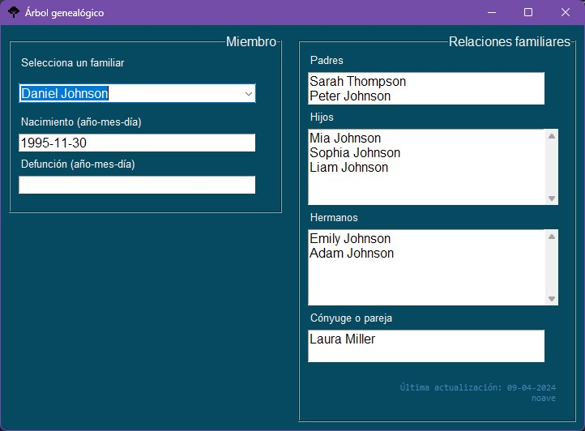
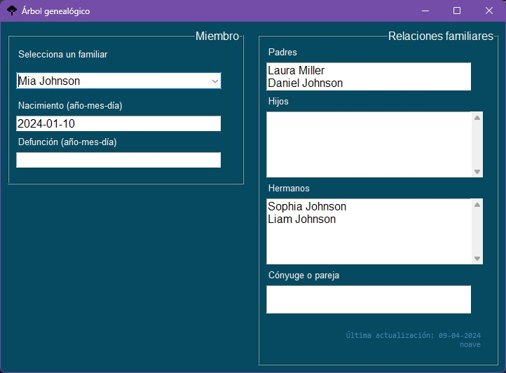

# Árbol genealógico

Aplicación para visualizar una base de datos con los miembros de una familia.  

  

El menú desplegable ofrece una búsqueda ordenada alfabéticamente. La interfaz muestra los siguientes datos cuando estos hayan sido almacenados:
- FECHA DE NACIMIENTO
- FECHA DE DEFUNCIÓN
- PADRES
- HIJOS
- HERMANOS
- CÓNYUGE

Las fechas se muestran con formato YYYY-MM-DD.  

  

---

Hecho con Python 3.10 (tkinter).  
Base de datos: SQLite.  
2022